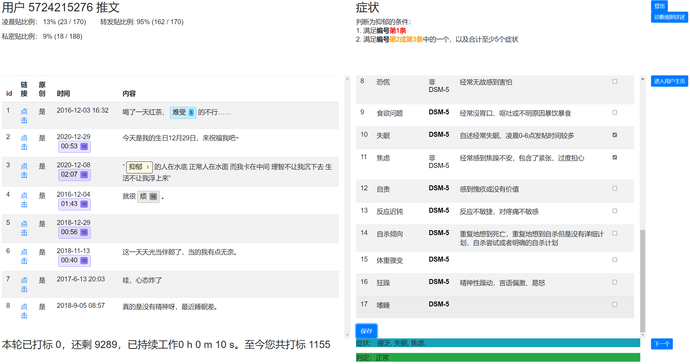
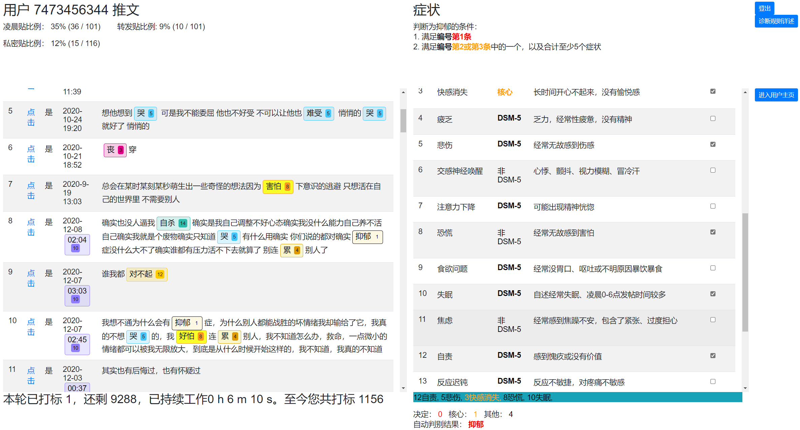

# Simple Annotator For Depression

A flask-based labeling system for depression that supports multi-person labeling.

## Environment

Ubuntu 18.04

python 3.7 (anaconda3) + mongodb

## Setup
### venv
```
conda create -n XXX python=3.7
```

### dependencies
```
pip install -r requirements.txt
```
### settings
1. Edit `conf/settings.py` and modify the following items:
    ```
    SECRET_KEY = os.environ.get('SECRET_KEY') or 'your-secret'
    MONGO_USERNAME = 'YOUR_USERNAME'
    MONGO_PASSWORD = 'YOUR_PASSWORD'
    MONGO_HOST = 'YOUR_IP'
    MONGO_PORT = 'YOUR_PORT'
    MONGO_DATABASE = 'YOUR_DBNAME'
    ```
    
2. Edit `log-app.conf` and modify the store path of log file
    ```
    args=('/path/to/log/flask-rest-sample.log','a','utf8')
    ```


## Screen shots






## Instructions

- The tagger screen the user tweets listed on the left column, and checks the corresponding depressive symptoms on the right column
- The system will automatically judges on whether the user has depression or not in real time and show the results at the bottom of the right column.
- Once finished, click "save" at the bottom of the right column, and the system will tag the sample automatically.

## Labeling Criteria

① User who self-reports of depression and provides a hospital certificate of diagnosis is directly labeled as depressed, otherwise subject to ②

② User is labeled as depression if it shows at least five symptoms in Table below, and at least one of them is the first or second symptom in the table. 

| Ind  | Category |           Symptom            |                         Description                          |
| :--: | :------: | :--------------------------: | :----------------------------------------------------------: |
|  1   |  DSM-5   |           Sadness            | Feel sad, empty, hopeless most of the day (as indicated by either subjective account or observation) |
|  2   |  DSM-5   | Loss of interest or pleasure | Markedly diminished interest/pleasure in all, or almost all, activities (as indicated by either subjective account or observation) |
|  3   |  DSM-5   |       Appetite problem       | Significant decrease or increase in appetite (as indicated by description of nausea and vomiting and its frequency) |
|  4   |  DSM-5   |        Weight problem        | Significant weight loss when not dieting or weight gain (e.g, self-describe of a change of more than 5% of body weight in a month) |
|  5   |  DSM-5   |           Insomnia           | Self-describe of insomnia or have great proportion of tweets posted during 0-6 am |
|  6   |  DSM-5   |         Hypersomnia          | Self-describe of hypersomnia (e.g, feeling hard to get up at daytime) |
|  7   |  DSM-5   |          Agitation           | Psychomotor agitation (as indicated by either subjective account or observation. e.g, often post tweets containing aggressive words or feelings of restlessness) |
|  8   |  DSM-5   |         Retardation          | Psychomotor retardation (as indicated by subjective feelings of being slowed down) |
|  9   |  DSM-5   |         Energy loss          | Fatigue or loss of energy most time (as indicated by self-description of such condition) |
|  10  |  DSM-5   |          Self-shame          | Feelings of worthlessness or excessive or inappropriate guilt which may be delusional (as indicated by self-description of such condition) |
|  11  |  DSM-5   |    Concentration problem     | Diminished ability to think or concentrate, or indecisiveness (as indicated by self-description of such condition) |
|  12  |  DSM-5   |      Suicidal ideation       | Recurrent thoughts of death or a suicide attempt or a specific plan for committing suicide (as indicated by pictures of self-harm or self-description of such condition) |
|  13  |  Other   |     Sympathetic arousal      | Self-description of palpitation, chest pain, headache without any reason |
|  14  |  Other   |            Panic             |     Self-description of get terrified without any reason     |
|  15  |  Other   |           Anxious            | Self-description of feeling worried, tense all the time without any reason |

